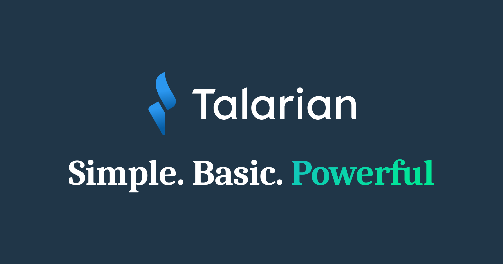

  

  <strong>We create tools that give you wings.</strong>

  Spreadsheet-driven business apps for Google Sheets and Excel.

  <a href="https://talarian.io">Website</a> ·
  <a href="https://www.linkedin.com/company/talarian">LinkedIn</a> ·
  <a href="https://x.com/TalarianHQ">X</a> ·
  <a href="https://github.com/ScriptAddicts">GitHub</a>

---

## About

Talarian is a bootstrapped, growing and profitable software company founded in 2015. We build lightweight spreadsheet-driven business applications.

Our main products are [YAMM](https://yamm.com), [GPT for Work](https://gptforwork.com) / [Autosheet](https://autosheet.com), [Awesome Table](https://awesome-table.com), and [Form Publisher](https://form-publisher.com). They are used and loved by millions, and are among the most popular products in the Google Workspace and Microsoft marketplaces.

Basecamp in Paris, France. A global team that makes global products.

<table align="center">
  <tr>
    <td align="center"><strong>60M+</strong> installs</td>
    <td align="center"><strong>4.7/5</strong> rating</td>
    <td align="center"><strong>100K+</strong> customers</td>
  </tr>
</table>

We build for simplicity, empowerment, and getting out of the way.

## Products

| | |
|---|---|
| [**GPT for Work**](https://gptforwork.com) / [**Autosheet**](https://autosheet.com) | AI agent plugins for Excel & Sheets: automate formulas, formatting, analysis and bulk data work. For AI agents: [MCP server & API](https://autosheet.com). Listed in the official [Claude connector directory](https://claude.ai/directory/connectors/autosheet). |
| [**YAMM**](https://yamm.com) | Mail merge: bulk send and track personalized emails with Gmail from Google Sheets |
| [**Awesome Table**](https://awesome-table.com) | Connectors: export data to Google Sheets. Apps: make a catalog from Google Sheets |
| [**Form Publisher**](https://form-publisher.com) | Document generator: generate templated documents from Google Forms or Sheets |

---

  

